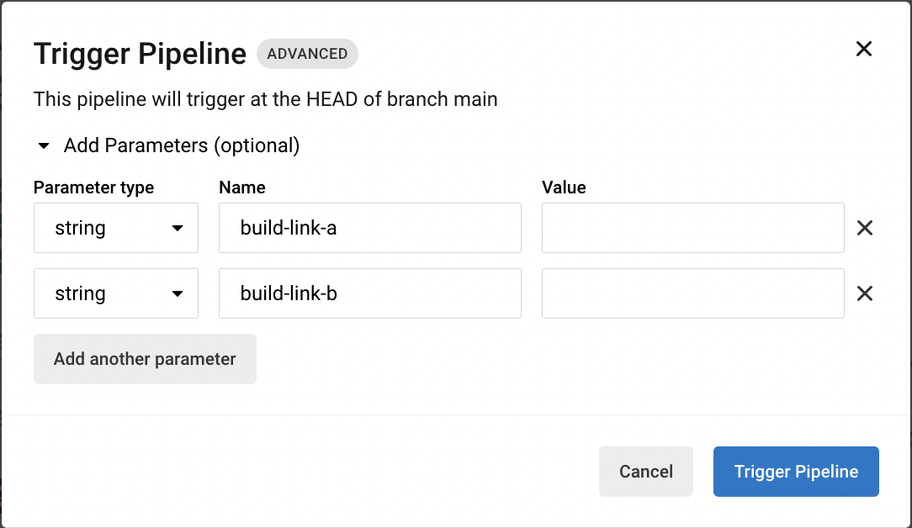
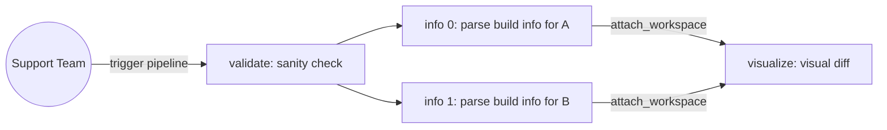

# CircleCI Build Compare

Compare (diff) between builds on CircleCI Cloud to see what changed!

Also, this dogfoods CircleCI features whenever applicable :nerd_face:

## Pipeline

We have set up a CircleCI pipeline that runs comparisions between builds.
Check out the _.circleci/config.yml_ for more details.
### Workflows

`diff-builds`

This does the following:

1. Run a sanity check on the 2 build links (e.g., same project)
2. Parse build link to retrieve build information via CircleCI API (`parallelism: 2`)
3. Generate a visual diff on the build information.

