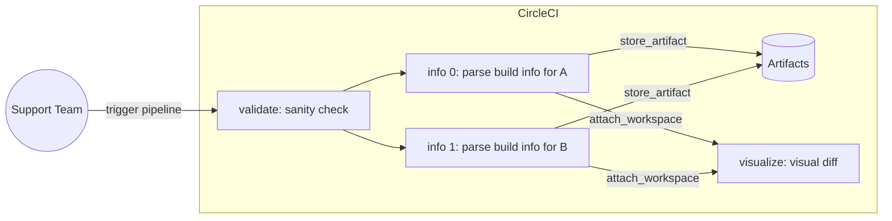

# CircleCI Build Compare

Compare (diff) between builds on CircleCI Cloud to see what changed!

Also, this dogfoods CircleCI features whenever applicable :nerd_face:

## Pipeline

**How to use?**

1. Trigger the CircleCI pipeline on the `main` branch.
2. Enter the 2 builds' links as pipeline parameters `build-link-a` and `build-link-b`.
3. Note that the 2 build links **must** be about a specific **job**, not the workflow.

> Check out the _.circleci/config.yml_ for more details.
### Workflows

`diff-builds`

This does the following:

1. Run a sanity check on the 2 build links (e.g., same project)
2. Parse build link to retrieve build information via CircleCI API (`parallelism: 2`)
    * save build information as artifact (YML file).
3. Generate a visual diff on the build information.

