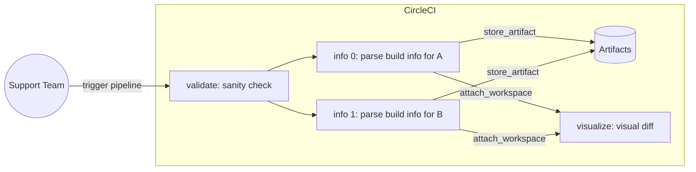

# CircleCI Build Compare

Compare (diff) between builds on CircleCI Cloud to see what changed!

Also, this dogfoods CircleCI features whenever applicable :nerd_face:

## Important

:warning: **Please do not fork this repository!** :warning:

  
Why forking is not recommended?

I understand that [GitHub only allows public repositories to be forked](https://docs.github.com/en/get-started/quickstart/fork-a-repo).
In addition, you also cannot convert a forked repository to private thereafter easily.

Because [all builds for a CircleCI public project will be viewable by anyone](https://circleci.com/changelog/#public-build-pages),
triggering the pipeline here can expose build info unwittingly **if the project is public**.

---

This is [a template repository](https://docs.github.com/en/repositories/creating-and-managing-repositories/creating-a-template-repository).

In other words, please create a new repository from this template instead.
See https://docs.github.com/en/repositories/creating-and-managing-repositories/creating-a-repository-from-a-template#creating-a-repository-from-a-template

In fact, the recommended steps are:

1. Create a new repository from this template repository on GitHub.
2. Change repository settings from public to **private**.
3. Set up project on CircleCI.
4. Create [a new CircleCI API token](https://circleci.com/docs/2.0/managing-api-tokens/#creating-a-personal-api-token), if you have not.
5. Add this CircleCI API token as a `CIRCLE_TOKEN` [project environment variable](https://circleci.com/docs/2.0/env-vars/#setting-an-environment-variable-in-a-project).
6. Start triggering the pipeline (see below)!

> **Note** that you can only compare the builds where the CircleCI user owning this CircleCI API token is permitted to view.

## Pipeline

**How to use?**

1. Trigger the CircleCI pipeline on the `main` branch.
2. Enter the 2 builds' links as pipeline parameters `build-link-a` and `build-link-b`.
3. Note that the 2 build links **must** be about a specific **job**, not the workflow.

> Check out the _.circleci/config.yml_ for more details.
### Workflows

`diff-builds`

This does the following:

1. Run a sanity check on the 2 build links (e.g., same project)
2. Parse build link to retrieve build information via CircleCI API (`parallelism: 2`)
    * save build information as artifact (YML file).
3. Generate a visual diff on the build information.

